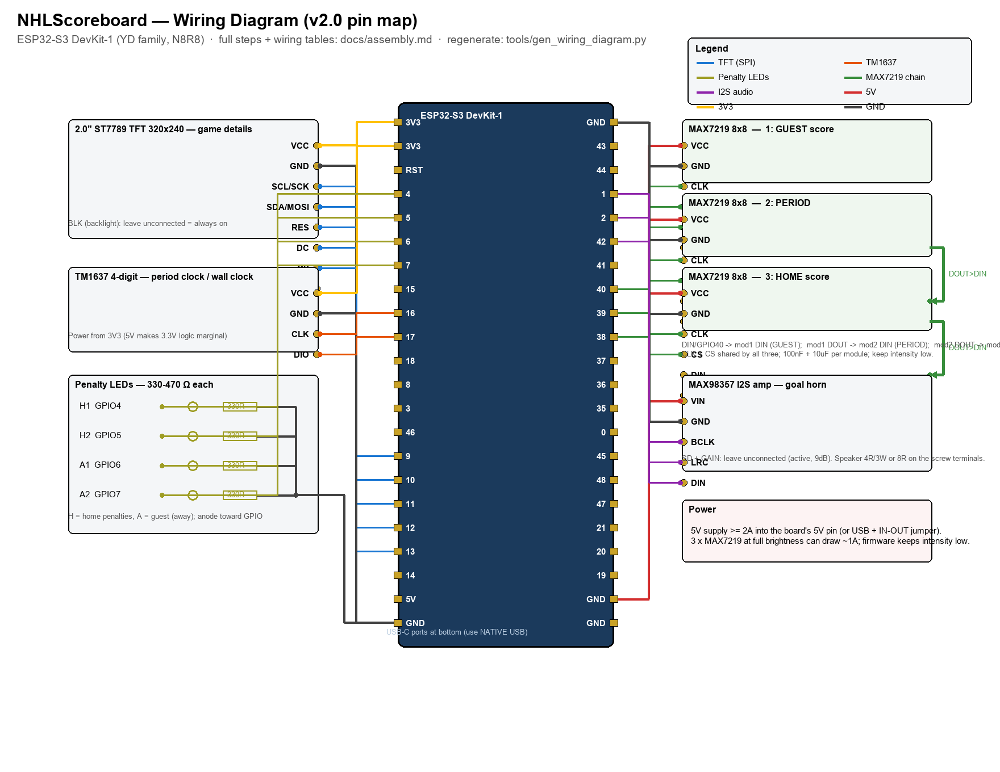

# NHLScoreboard — Assembly & Wiring Guide

Everything needed to wire the scoreboard end to end. The pin plan and its
rationale live in [`hardware.md`](hardware.md); this document is the
build-side companion: parts, wiring tables, the rendered diagram, assembly
order, and the first-boot checklist. Firmware **v3.44** drives the
backplane-PCB pin map used here (TFT and guest penalty LEDs moved — see
`hardware.md`).

*(Diagram regenerated by `tools/gen_wiring_diagram.py` whenever pins
change — edit the script, not the PNG.)*

## Parts list

| Qty | Part | Role | Notes |
|---|---|---|---|
| 1 | ESP32-S3 DevKit-1 (N8R8) | controller | 8 MB flash, octal PSRAM; native USB-C port used for power/flash/serial |
| 1 | 2.0" ST7789V TFT, 240×320, SPI | game details screen | 7-pin module (VCC GND SCL SDA RES DC CS BLK) |
| 3 | MAX7219 8×8 LED matrix module | away score, home score, period | generic red 4-board strips split into single modules; daisy-chained |
| 1 | TM1637 4-digit 7-segment module | period clock / wall clock | 4 pins: VCC GND CLK DIO |
| 1 | MAX98357A I2S amp breakout | goal-horn audio | plus a 4 Ω/3 W (or 8 Ω) speaker |
| 4 | LED + 330–470 Ω resistor | penalty indicators | 2 home, 2 guest; 3 mm or 5 mm, any color |
| — | hookup wire, headers, perfboard | assembly | 22–24 AWG for power runs |

Power: a **5 V ≥ 2 A** supply feeding the board's 5V pin (or a strong USB
supply with the board's `IN-OUT` jumper closed). Three MAX7219 modules at
full brightness alone can draw ~1 A; the firmware keeps intensity low, but
size for the worst case.

## Wiring tables

Physical positions refer to the header map in `hardware.md` (counting from
the end nearest the RST button / top of the board photo).

### TFT — game details (left header)

| TFT pin | Goes to | GPIO | Phys. pos |
|---|---|---|---|
| VCC | 3V3 | — | L1/L2 |
| GND | GND | — | L22 |
| SCL/SCK | TFT SCK | 8 | L12 |
| SDA/MOSI | TFT MOSI | 3 | L13 |
| RES | TFT RESET | 46 | L14 |
| DC | TFT DC | 9 | L15 |
| CS | TFT CS | 10 | L16 |
| BLK | *(leave unconnected — backlight always on)* | — | — |

### TM1637 — period clock / wall clock (left header)

| TM1637 pin | Goes to | GPIO | Phys. pos |
|---|---|---|---|
| VCC | **3V3** (not 5 V — keeps logic levels matched) | — | L1/L2 |
| GND | GND | — | L22 |
| CLK | TM1637 CLK | 16 | L9 |
| DIO | TM1637 DIO | 17 | L10 |

### Penalty LEDs (left header)

GPIO → LED anode → resistor → GND, one per LED:

| LED | GPIO | Phys. pos | Resistor |
|---|---|---|---|
| Home penalty 1 | 4 | L4 | 330–470 Ω |
| Home penalty 2 | 5 | L5 | 330–470 Ω |
| Guest penalty 1 | 11 | L17 | 330–470 Ω |
| Guest penalty 2 | 12 | L18 | 330–470 Ω |

### MAX7219 chain — scores + period (right header)

| MAX7219 pin | Goes to | GPIO | Phys. pos |
|---|---|---|---|
| VCC (all 3) | 5V | — | L21 |
| GND (all 3) | GND | — | R1 |
| CLK (all 3, shared) | MAX7219 CLK | 39 | R9 |
| CS/LOAD (all 3, shared) | MAX7219 CS | 38 | R10 |
| DIN (**module 1 only**) | MAX7219 DIN | 40 | R8 |
| DOUT module 1 → | DIN module 2 | — | jumper |
| DOUT module 2 → | DIN module 3 | — | jumper |

Module order in the chain is **1 = guest score, 2 = period, 3 = home
score** (the shared-load shift order is handled in the driver). Add
100 nF + 10 µF decoupling per module.

### MAX98357A — goal horn (right header)

| Amp pin | Goes to | GPIO | Phys. pos |
|---|---|---|---|
| VIN | 5V | — | L21 |
| GND | GND | — | R1 |
| BCLK | I2S BCLK | 1 | R4 |
| LRC | I2S LRC/WS | 2 | R5 |
| DIN | I2S data | 42 | R6 |
| SD, GAIN | *(leave unconnected — active, 9 dB gain)* | — | — |

Speaker lands on the amp's screw terminals (4 Ω/3 W or 8 Ω).

### Power/ground summary

| Rail | Sources on board | Consumers |
|---|---|---|
| 3V3 | L1, L2 | TFT VCC, TM1637 VCC |
| 5V | L21 | 3× MAX7219 VCC, MAX98357 VIN |
| GND | L22, R1, R21, R22 | **everything** — one common ground |

## Assembly order

1. **Flash first, wire second.** With the bare board on USB, flash v2.0
   (`pio run -e esp32-s3-devkitc-1 -t upload --upload-port COM15`) and
   confirm the boot splash and the `NHL_SCOREBOARD` setup AP appear — a
   known-good controller before adding wiring.
2. Unplug. Mount the board and modules (perfboard/standoffs), keeping the
   matrix chain and amp away from the TFT ribbon.
3. **Power rails first**: 5 V and 3 V3 distribution, then a solid common
   ground tying every module back to the board.
4. TFT (7 wires, left header 15–19 + rails).
5. TM1637 (4 wires, left 9–10 + rails — 3V3!).
6. Penalty LEDs + resistors (home left 4–5, guest left 17–18).
7. MAX7219 modules: mount in order, wire the shared CLK/CS, feed DIN of
   module 1 from GPIO 40, then jumper DOUT→DIN between modules.
8. MAX98357 + speaker (right 4–6 + rails).
9. Double-check every row of the tables against the diagram before
   powering up.

## First-boot checklist

1. Splash shows the NHL logo + `v2.0`, then the setup screen with QR.
2. Join `NHL_SCOREBOARD`, configure Wi-Fi + your three teams in the
   portal, save — board reboots into waiting mode.
3. Waiting mode: TFT rotates upcoming-game card → league scores → news;
   **TM1637 shows the wall clock**; matrices show the idle clock (if
   enabled in the portal).
4. When a preferred team plays: live screen (logos, score, period,
   clock, SOG, penalties) within a minute of puck drop; **matrices show
   the scores, penalty LEDs light during power plays, TM1637 shows the
   period clock** (colon lit while play runs).
5. To watch the display bindings on serial (nothing to trust, just to
   see): build with `-DSB_DEBUG=1` and watch the `[BIND]` lines — one per
   5 s poll listing every value handed to the display drivers.

## Troubleshooting

- **Blank TFT**: check BLK isn't tied low, and that SCL/SDA didn't swap
  (GPIO 8 = SCK, GPIO 3 = MOSI on the PCB-rev map).
- **Garbled/one dead matrix**: the chain is positional — module 1 must be
  the one receiving GPIO 40 DIN; DOUT→DIN jumpers seat fully.
- **Dim or dead TM1637**: it's on 3V3 by design; on 5 V its inputs may
  miss 3.3 V logic highs.
- **No goal horn**: audio playback HAL is not implemented yet (the amp is
  wired for the day it lands — see `hardware.md` driver notes).
- **Everything dead at once**: measure 5 V at the board and at the far
  MAX7219; a starved rail browns out the matrices first.
- **First matrix works, downstream matrices dark**: measure the 5 V rail
  under load (during the display test's all-on phase — worst case ~1 A).
  A supply that sags browns out the modules further down the power bus
  while the one nearest the feed keeps running; it looks exactly like a
  broken DOUT→DIN chain link but isn't. (Seen in the field: fine on a
  boosted 5 V supply, modules 2–3 dark on a weaker one.)
